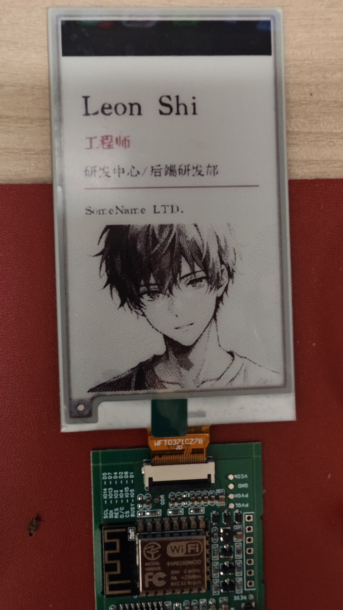

# esp8266-eink-badge

ESP8266 驱动 3.7 寸黑白红三色墨水屏，通过 Wi-Fi 从上位机拉取内容，用于显示工卡、名片、会议室状态等场景。



---

## 硬件

| 参数 | 值 |
|------|----|
| 主控 | ESP8266 (NodeMCU v2) |
| 屏幕 | WFT0371CZ78 / GDEY037Z03 |
| 驱动芯片 | UC8253 |
| 分辨率 | 240 × 416 |
| 颜色 | 黑 / 白 / 红 三色 |
| 局部刷新 | 支持（仅黑白通道） |

**接线（ESP8266 → 屏幕）：**

| ESP8266 引脚 | 功能 |
|-------------|------|
| GPIO15 (D8) | CS   |
| GPIO4  (D2) | DC   |
| GPIO2  (D4) | RST  |
| GPIO5  (D1) | BUSY |
| GPIO13 (D7) | MOSI |
| GPIO14 (D5) | SCK  |

---

## 固件（`epd-sync/`）

设备通过 Wi-Fi 定期向上位机轮询内容（Pull 模式），内容有更新时流式下载并刷新屏幕。

### 配置（`epd-sync/config.h`）

```c
#define WIFI_SSID         "your-ssid"
#define WIFI_PASSWORD     "your-password"
#define SYNC_HOST         "192.168.1.x"  // 运行 epd-tool serve 的机器 IP
#define SYNC_PORT         8080
#define PULL_INTERVAL_MS  60000          // 轮询间隔（毫秒）
```

### 设备 ID

固件启动时自动取 MAC 地址后 3 字节生成 6 位十六进制 ID（如 `5AE103`），每次请求携带该 ID，上位机据此返回对应内容。串口监视器会打印设备 ID。

### 按键

- **BOOT 键（GPIO0）短按**：立即触发全量刷新，重新拉取最新内容

### Pull 模式流程

1. 每隔 `PULL_INTERVAL_MS` 发 `POST /version`（body: `{"id":"XXXXXX"}`）
2. 版本号有变化时，再发 `POST /current.epd` 流式下载图像
3. 下载完成后刷新屏幕；若服务端返回 204（设备未配置）则静默跳过

### 编译 & 烧录

```bash
arduino-cli compile --fqbn esp8266:esp8266:nodemcuv2 epd-sync/
arduino-cli upload  --fqbn esp8266:esp8266:nodemcuv2 -p /dev/cu.usbserial-XXXX epd-sync/
```

依赖库：GxEPD2、ArduinoJson、Adafruit GFX

---

## 上位机 CLI（`cli/`）

Python 工具，将 YAML 模板渲染成 `.epd` 图像，通过 HTTP 服务下发给设备。

### 安装

```bash
cd cli
pip install -e .
```

### 快速上手

**1. 启动服务（Pull 模式）**

```bash
# 多设备模式（推荐）：每台设备对应独立模板和数据
epd serve --db epd-devices.db --port 8080
```

**2. 注册设备**

首次连接时服务端会打印提示，按提示执行：

```bash
epd device assign 5AE103 cli/templates/badge.yaml \
    --data '{"name":"张三","title":"高级工程师","department":"研发部","company":"ACME Corp"}'
```

**3. 查看已注册设备**

```bash
epd device list
```

**4. 更新内容**（重新 assign 即可，版本号自动递增，设备下次轮询时自动更新）

```bash
epd device assign 5AE103 cli/templates/badge.yaml \
    --data '{"name":"张三","title":"技术总监","department":"研发部","company":"ACME Corp"}'
```

### 所有命令

#### `epd render` — 本地渲染预览

```bash
epd render cli/templates/badge.yaml \
    -d '{"name":"张三","title":"工程师","department":"研发部","company":"ACME"}' \
    --preview        # 打开预览窗口
    --out badge.epd  # 保存为 .epd 文件
```

#### `epd serve` — 启动 HTTP 服务

```bash
# 多设备 DB 模式
epd serve --db epd-devices.db --port 8080

# 单模板模式（所有设备同一内容）
epd serve cli/templates/badge.yaml \
    -d '{"name":"张三","title":"工程师","department":"研发部","company":"ACME"}' \
    --watch   # 模板文件变化时自动重渲染
```

#### `epd device` — 设备管理

```bash
epd device list                         # 列出所有已注册设备
epd device assign <ID> <template.yaml> --data '{...}'  # 注册/更新设备
epd device label  <ID> "张三的工卡"     # 设置备注名
epd device delete <ID>                  # 删除设备
```

#### `epd push` — 直接推送（Push 模式）

```bash
epd push cli/templates/namecard.yaml \
    -d '{"name":"李四","title":"设计师","email":"li@acme.com","phone":"138-0000-0000","company":"ACME"}' \
    -H 192.168.1.42
```

### 内置模板

| 模板 | 说明 | 变量 |
|------|------|------|
| `cli/templates/badge.yaml` | 工卡 | `name` `title` `department` `company` `avatar`（可选） |
| `cli/templates/namecard.yaml` | 名片 | `name` `title` `email` `phone` `company` |
| `cli/templates/meeting-room.yaml` | 会议室状态 | `room_name` `status` `next_meeting` `next_time` |

字体使用 `cli/fonts/KingHwa_OldSong.ttf`（王汉宗老宋体），中文显示效果佳。

### 模板格式

```yaml
size: [240, 416]
background: white
elements:
  - type: text
    text: "{{ name }}"
    font: KingHwa_OldSong
    size: 28
    color: black        # black | red | white
    pos: [20, 100]
    align: left         # left | center

  - type: rect
    rect: [x, y, w, h]
    fill: red
    outline: black      # 可选

  - type: line
    start: [20, 200]
    end:   [220, 200]
    color: red
    width: 2

  - type: image
    src: "avatar.png"
    rect: [x, y, w, h]
    fit: cover          # cover | contain | stretch
```

---

## `.epd` 文件格式

| 偏移 | 大小 | 内容 |
|------|------|------|
| 0 | 4 B | Magic: `EPD2`（`0x45 0x50 0x44 0x32`） |
| 4 | 2 B | Width（uint16 LE）= 240 |
| 6 | 2 B | Height（uint16 LE）= 416 |
| 8 | 12480 B | BW 平面（1=白 0=黑），写入显存 `0x10` |
| 12488 | 12480 B | Red 平面（1=无红 0=红），写入显存 `0x13` |
| **合计** | **24968 B** | |

---

## 项目结构

```
esp8266-eink-badge/
├── GxEPD2_370C_UC8253.h/.cpp # UC8253 屏幕驱动（自定义）
├── config.h                  # WiFi / Sync 配置
├── epd-sync/                 # 固件源码
│   ├── epd-sync.ino
│   ├── GxEPD2_370C_UC8253.h/.cpp
│   └── config.h
├── cli/                      # Python CLI 工具
│   ├── pyproject.toml
│   ├── fonts/
│   │   └── KingHwa_OldSong.ttf
│   ├── templates/
│   │   ├── badge.yaml
│   │   ├── namecard.yaml
│   │   └── meeting-room.yaml
│   └── epd_tool/
│       ├── cli.py
│       ├── render.py
│       ├── serve.py
│       ├── db.py
│       ├── push.py
│       └── format.py
└── docs/
    └── demo.jpg
```
